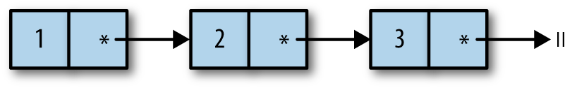

Note - empty list `[]` is polymorphic, i.e. can be used with elements of any type.

Lists in OCaml are singly linked lists. I.e. in `1 :: 2 :: 3 :: []`, each `::` adds a new block to the preceding block and each block contains two pieces of information, a reference to the data in that list element and a reference to the remainder of the list.



Pattern matching is very efficient and it's usually a win over what you might write by hand.

You should avoid using the ^ pairwise operator for joining long numbers of strings, because it allocates a new string every time it runs. Use **String.concat** instead.

### Tail recursion

Typically, a function call needs some space to keep track of information associated with the call, such as the arguments passed to the function, or the location of the code that needs to start executing when the function call is complete.

To allow for nested function calls, this information is typically organized in a stack, where a new _stack frame_ is allocated for each nested function call and then deallocated when the function call is complete.

```ocaml
let make_list n = List.init n ~f:(fun x -> x);;
val make_list : int -> int list =

length (make_list 10);;
- : int = 10
length (make_list 10_000_000);;
Stack overflow during evaluation (looping recursion?).
```

In the above example we tried to allocate 10 million stack frames for our function call.

The alternative approach would be depending on a helper function which has an extra argument that acts as an accumulator and is built up step by step. Rather than doing one big calculation as we unwind the nested sequence of function calls:

```ocaml

let rec length_plus_n l n =
  match l with
  | [] -> n
  | _::tl -> length_plus_n tl (n + 1)

let length l = length_plus_n l 0

```

Here _length_plus_n_ is called a tail call. Tail calls don't require the allocation of a new stack frame, due to what is called the **tail-call optimization**.

If you think about a situation where one function (The caller) invokes another (the callee), the invocation would be considered a tail call when the caller doesn't do anything with the value returned by the callee except to return it. When a caller makes a tail call, the caller's stack frame need never to be used again, therefore instead of allocating a new stack frame for the callee, the compiler is free to reuse the caller's stack frame. _(tail-call optimization)_

Note - Base's default equality operator is specialized to integers. OCaml has a collection of polymorphic equality and comparison operators, which you can make available by opening the module Base.Poly.

```ocaml
(=) : 'a -> 'a -> bool

```
